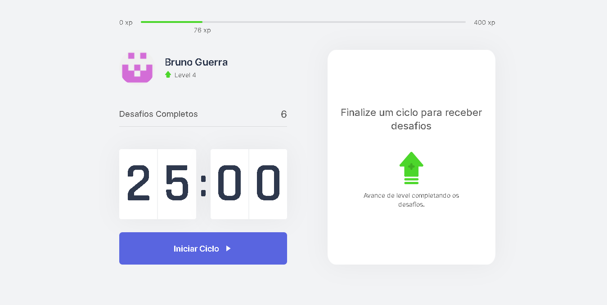
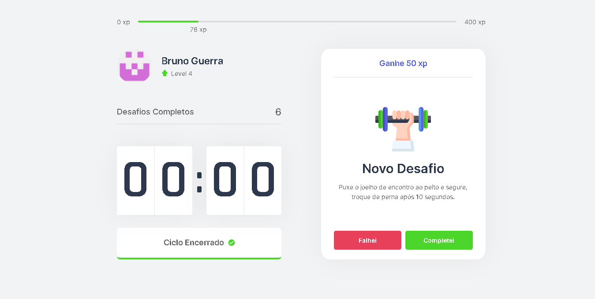

## Pomo.io

Application in NextJS. Pomodoro timer with challenges.

## Technology

Here are the technologies used in this project.

- React with NextJS
- Typescript
- Sass (extension .scss)

## Services Used

- Github
- Vercel

## Getting started

- Dependency

  - Js-cookie ^3.0.1
  - Next v12.1.0
  - React v17.0.2
  - Typescript ^4.5.5

## Run Project

- Start cloning the repository.

  `git clone https://github.com/brunorguerra/pomoio-nextjs`

- Then enter the folder. and install the dependencies.

  `npm install`

- To run the project.

  `npm run dev`
  
  ```http://localhost:3000/```

## How to use

### 1 - Upon entering you will see the home page. can start the timer



### 2 - after the timer ends you will receive a challenge to do. gaining xp



### 3 - Level Up message


## Features

The main features of the application are:

- timer with pomodoro practice.
- earn xp by finishing the proposed challenges at the end of each time.

## Links

- Deploy on Vercel: https://pomoio-nextjs.vercel.app/
- Repository: https://github.com/brunorguerra/pomoio-nextjs
  - In case of sensitive bugs like security vulnerabilities, please contact
    brunoguerracontact@gmail.com directly instead of using issue tracker. We value your effort
    to improve the security and privacy of this project!

## Versioning

1.0.0.0

## Authors

- **Bruno Bernardes Guerra**

Please follow github and join us!
Thanks to visiting me and good coding!
